# 씨네마담뚜(이재희, 이종현)


## 프로젝트 소개


#### 빠르고 편리하지만 다양한 기능과 깔끔한 UI 디자인으로 유저가 원하는 영화를 찾아줍니다.

#### 틴더가 애인이나 배우자를 찾아주는 것처럼 유저가 보고싶은 마음이 드는 영화를 찾아주는 사이트

#### 힘들게 찾아다니거나 검색할 필요 없이 마담뚜처럼 알아서 최적의 영화를 추천합니다.

#### 씨네마담뚜에서 당신의 인생 영화를 찾아보세요


---


### TMDB API 기반 영화 추천 사이트

* TMDB API의 데이터를 기반으로 이용자에게 맞춤 영화를 추천합니다.
* vue-tinder 라이브러리를 사용해서 쉽고 재밌게 유저의 취향을 분석하고 영화 리스트를 제공합니다.
* 영화마다 별점을 매길 수 있고, 코멘트를 작성할 수 있습니다.
* 영화 리뷰를 작성하여 다른 사람과 감상평을 공유할 수 있습니다.
* 유저 프로필 페이지에서 유저마다의 영화 장르 취향을 그래프로 쉽게 볼 수 있습니다.
* 여러 종류의 재밌고 재치있는 칭호를 통해 자신을 꾸밀 수 있습니다.
* 유저의 플레이리스트와 추천 영화를 공유할 수 있습니다.


## 팀원 소개 및 업무 분담 내역


### 이재희(팀장)

```
Vuejs 기본 구성
로그인 및 회원가입 구성
프론트엔드 내 데이터 이동 전체 담당
커뮤니티 기능 담당
영화 평점 기능 구현
```


### 이종현(팀원)

```
Django 기본 프로젝트 구성
영화 데이터베이스 구성
영화앱에 관련된 기능 담당
전반적인 페이지 디자인 담당
추천 시스템 담당
```

* 모든 작업은 Live Share를 통해 실시간으로 협업


## 협업 과정


### 1일차

* 프로젝트 시작 시 Git을 이용한 협업 보다는 라이브 쉐어를 이용한 방법이 효율적이라 판단
* Notion으로 회의록 작성 및 구현 완료 항목 공유, 목표 제안
* 장고 기본 구성 구현 및 Admin 기능 구현


### 2일차

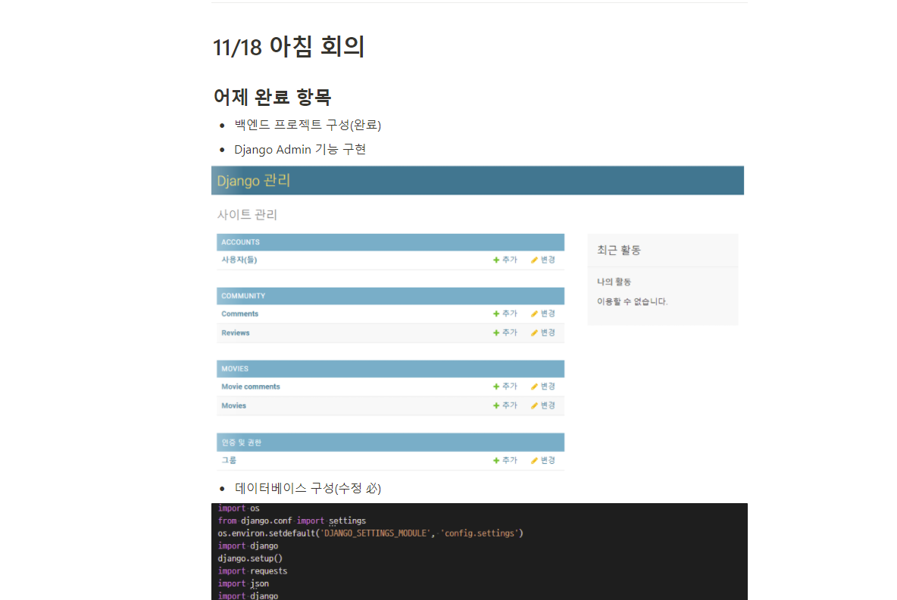

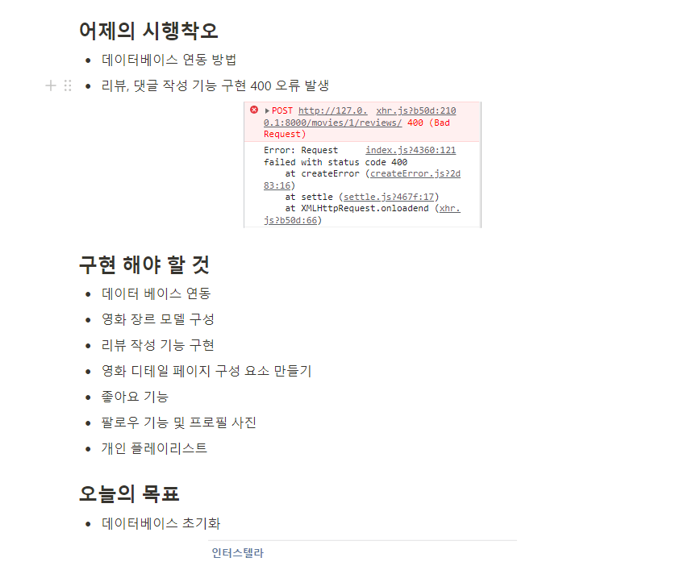

* 프로젝트 2일차 부터 아침회의를 통해 전날의 작업 현황과 당일 목표를 정함
* 오류 발생 항목들을 공유하면서 빠르게 해결하기 위해 노력
* 떠오른 아이디어나 기능들을 기록하면서 전체 페이지 구성


### 3일차

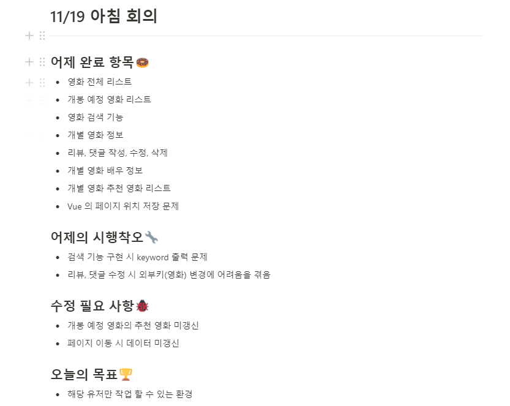


* 기본 기능 구현 완료
* 페이지 이동 시 데이터 미갱신 해결에 시간이 많이 소요됨


### 4일차

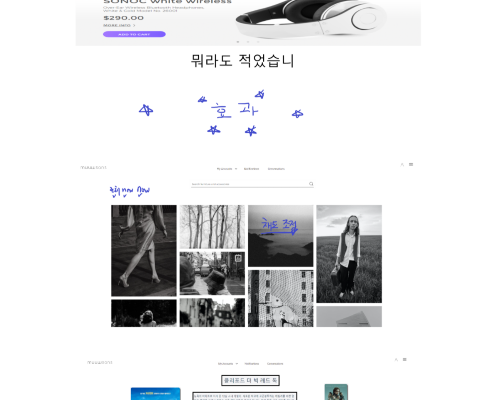

* 긴 시간의 회의 끝에 페이지 디자인 콘티 제작 완료
* 전체적으로 흑백톤으로 깔끔하고 세련된 디자인으로 목표를 정함


### 5일차

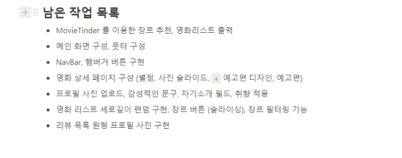

* 영화 추천 기능인 MovieTinder 사용 시작
* 디자인 작업 및 전체적인 인터페이스를 구현함


### 6일차

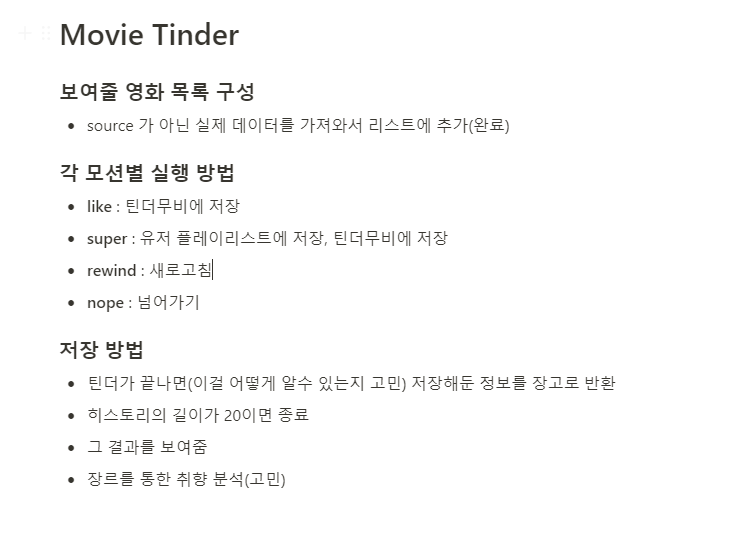

* 핵심 기능 중 하나인 Tinder 라이브러리 설치
* 다소 불친절한 README로 인해 직접 적용해가며 해결


### 7일차

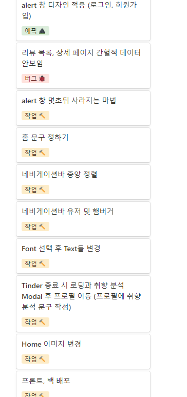

* 모든 페이지를 순서대로 이용해보면서 디테일 작업
* 사용할 글꼴 선택 및 구현 작업
* 남아있던 버그 해결


### 8일차

* 발생하는 모든 버그의 경우의 수를 확인하면서 기능마다 완성
* heroku를 사용해서 Django 배포 완료
* netlify를 사용해서 Vue 배포 완료
* 배포 시 해결했던 버그들이 다시 발생하여 수정
* 더미 데이터를 만들어 전체적인 디자인 수정


## 목표 서비스 구현 및 실제 구현 정도

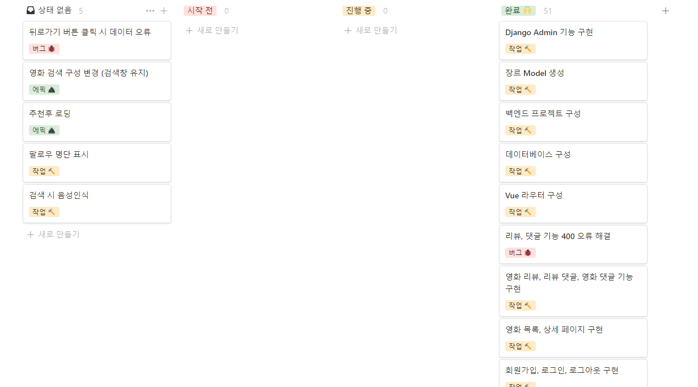


### 목표 서비스

* Django 기반의 백엔드 구성

* Vue 기반의 프론트엔드 구성
* 영화 목록 제공 
* 영화 목록에서 장르별 필터 적용 및 정렬 기능 제공
* 검색 시 해당 영화를 볼 수 있는 기능 제공
* 리뷰 게시판으로 다른 유저들과 소통 가능
* 틴더 앱 기능으로 취향을 분석할 수 있는 기능
* 유저 프로필에 해당 유저의 취향과 추천 영화를 표시하고 여러 커뮤니티 기능 구현


### 미구현 항목

* 뒤로가기 클릭시 데이터 로드 과정의 버그 수정
* 음성 인식 API를 활용하여 검색어 완성 기능
* 추천 서비스 이용 시 로딩 페이지 구성
* 유저의 팔로워 명단을 볼 수 있는 기능
* 영화 검색 시 검색 명단에서 재검색 기능


## 데이터베이스 모델링(ERD)


## 필수 기능

### 1. 관리자 뷰

i. 관리자 권한의 유저만 영화 등록/수정/삭제 권한을 가집니다.

ii. 관리자 권한의 유저만 유저 관리 권한을 가집니다. 

iii. 장고에서 기본적으로 제공하는 admin 기능을 이용하여 구현합니다.

iv. Vue.js를 활용하는 경우에도 Django admin기능을 이용하여 구현할 수 있습니다.

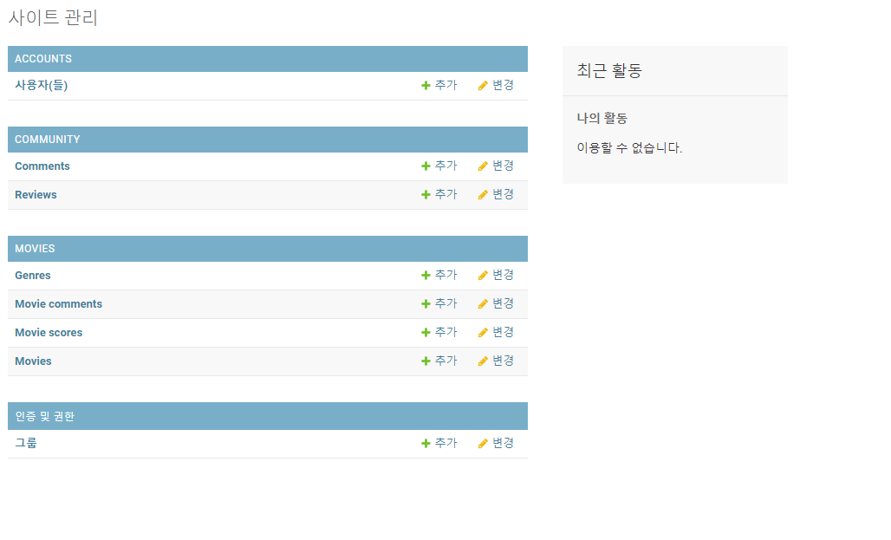

* 관리자 권한을 가진 유저만 영화 등록, 수정, 삭제 가능
* Django의 admin 기능을 활용

### 2. 영화 정보

i. 영화 정보는 Database Seeding을 활용하여 최소 50개 이상의 데이터가 존재하도록 구성해야 합니다.

ii. 모든 로그인 된 유저는 영화에 대한 평점 등록/수정/삭제 등을 할 수 있어야 합니다.

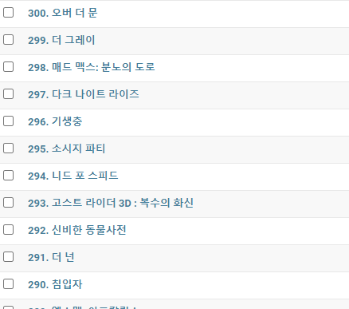

* TMDB API를 이용해서 300개의 영화 데이터를 저장

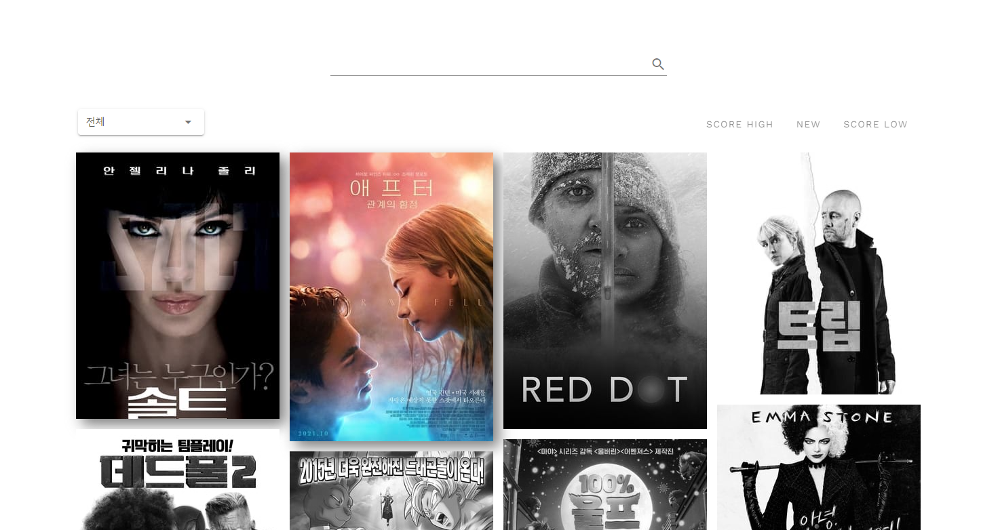

* 전체 영화 중 60개의 영화를 랜덤으로 리스트로 출력
* 장르별 영화를 볼 수 있고 평점 높은 순, 낮은 순, 최신 순으로 정렬 가능


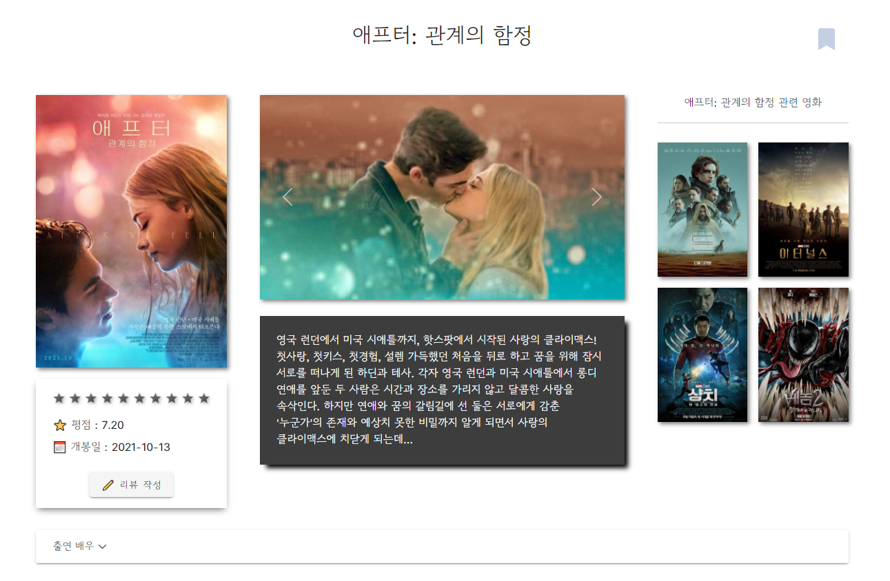

* 별점으로 1~10점을 부여할 수 있고, 실시간으로 평점이 갱신됨
* 기본 평가 인원 수를 10명으로 설정하고 평균으로 데이터베이스에 저장하여 유저의 평가가 쉽게 반영되도록 구현
* 평점 수정 가능
* 해당 영화의 관련 영화를 제공하고 그 영화의 포스터를 클릭하면 이동할 수 있게 구현

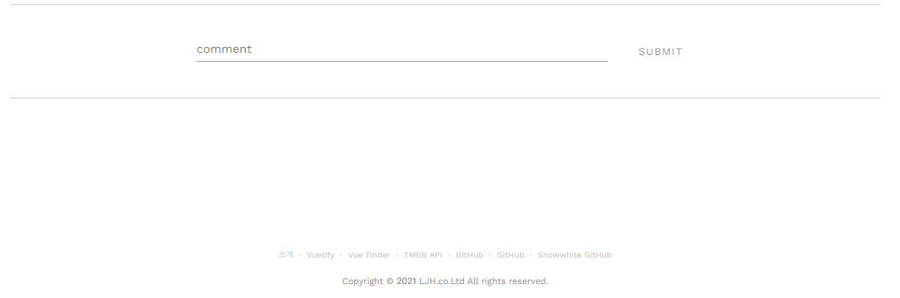

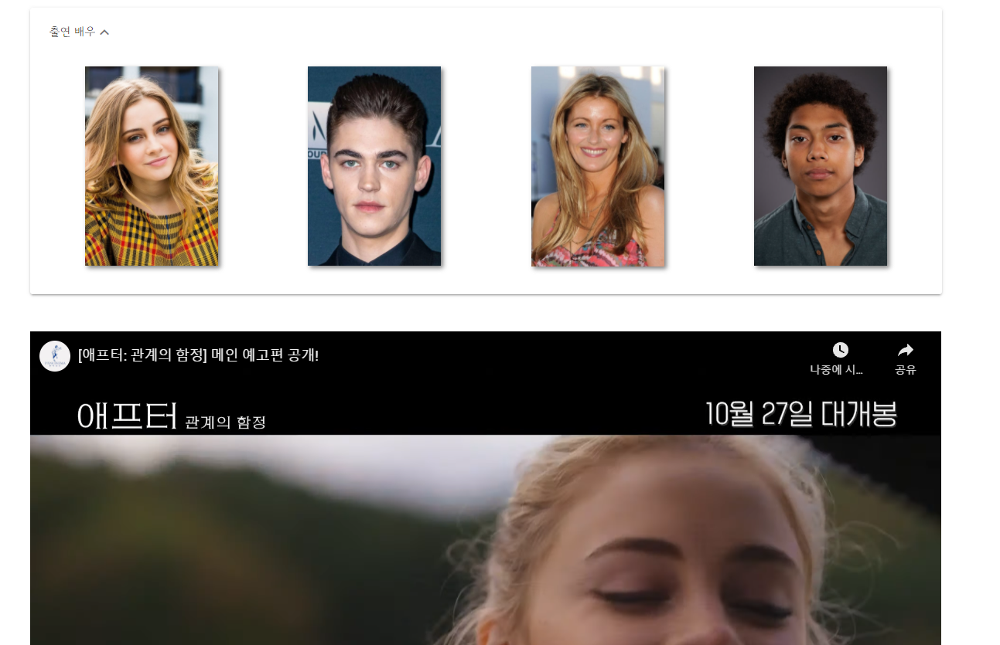

* 출연 배우의 이름, 배역과 Youtube API를 활용하여 예고편 제공

### 3. 추천 알고리즘

i. 평점을 등록한 유저는 해당 정보를 기반으로 영화를 추천 받을 수 있어야 합니다. 

ii. 추천 알고리즘의 지정된 형식은 없으나, 사용자는 반드시 최소 1개 이상의 방식으로 영화를 추천 받을 수 있어야 합니다. 

iii. 추천 방식은 각 팀별로 자유롭게 선택할 수 있으며 어떠한 방식으로 추천 시스템을 구성했는지 설명할 수 있어야 합니다.


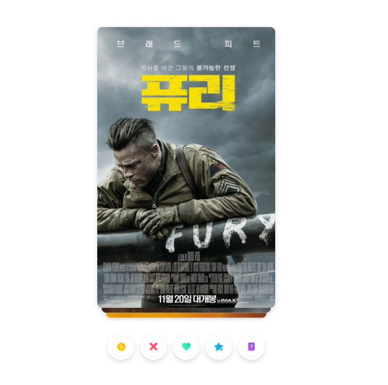

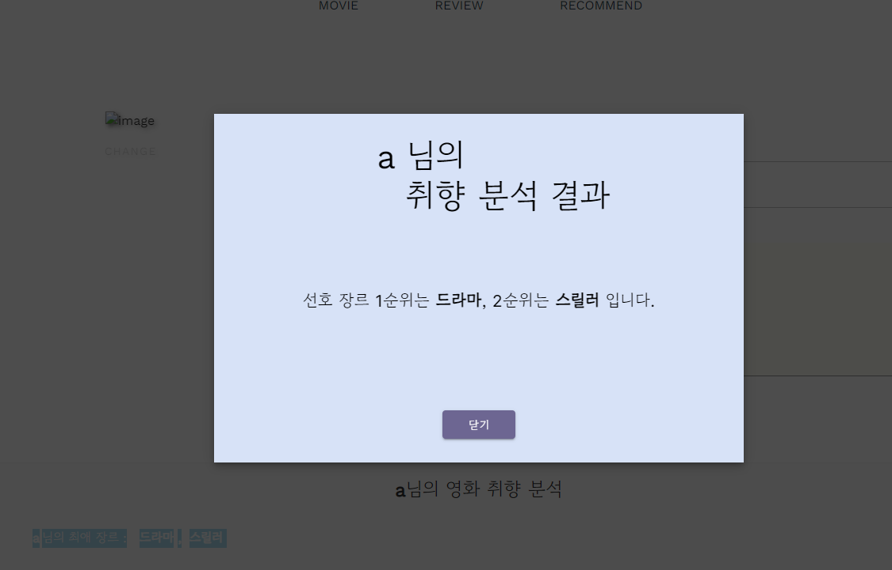

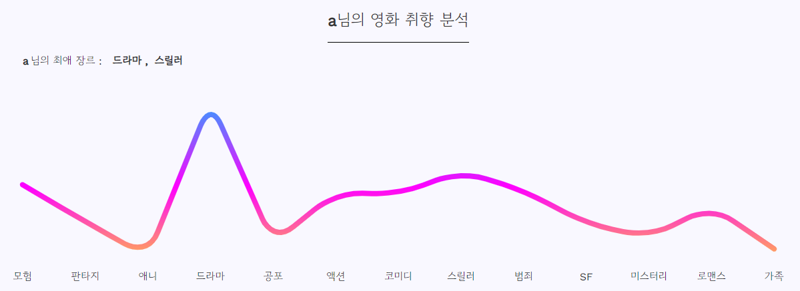

* 틴더 기능을 이용해서 유저는 15개의 영화를 평가한다.
* 해당 유저가 선택한 영화의 관련 영화를 검색하여 5개의 찾고, 이 영화들의 장르를 점수화 한다.
* 장르 점수를 기반으로 데이터베이스에 있는 해당 장르의 영화 리스트를 생성한다.
* 장르마다 부여된 점수만큼 영화들을 리스트에 저장하여 점수에 비례하여 영화가 담기도록 구성한다.
* 기존에 부여된 유저 맞춤 추천 영화 리스트를 초기화한다.
* 비례하게 구성된 영화 리스트를 랜덤하게 순서를 바꾸어 신뢰도를 높인다.
* 이 영화들 중에서 16개를 선택하여 추천 영화에 저장한다.
* 점수가 가장 높은 장르 2개를 선택하여 유저의 취향 장르에 저장한다.


### 4. 커뮤니티

i. 영화 정보와 관련된 대화를 할 수 있는 커뮤니티 기능을 구현해야 합니다. 

ii. 로그인한 사용자만 글을 조회/생성할 수 있으며 작성자 본인만 글을 수정/삭제 할 수 있습니다. 

iii. 사용자는 작성된 게시 글에 댓글을 작성할 수 있어야 하며, 작성자 본인만 댓글을 삭제할 수 있습니다. 

iv. 각 게시글 및 댓글은 생성 및 수정 시각 정보가 포함되어야 합니다.

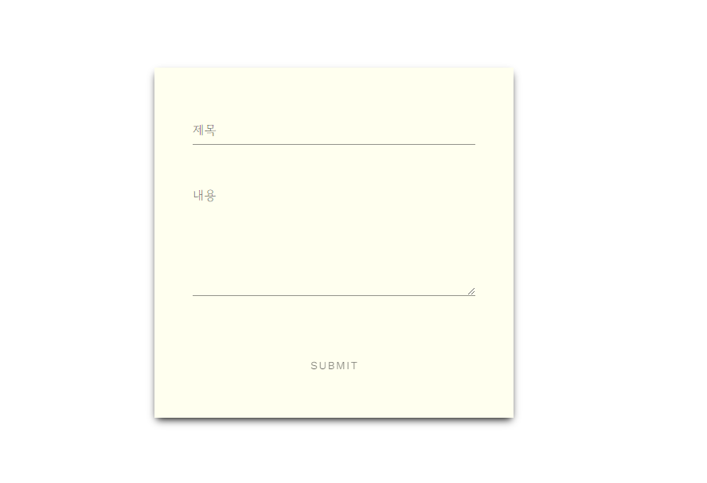

* 해당 영화의 디테일 페이지에서 리뷰 작성으로 이동 가능
* 제목과 내용을 입력할 수 있고, 내용 부분에 엔터키로 줄바꿈이 가능하도록 구현
* 작성 완료 시 리뷰 게시판으로 이동

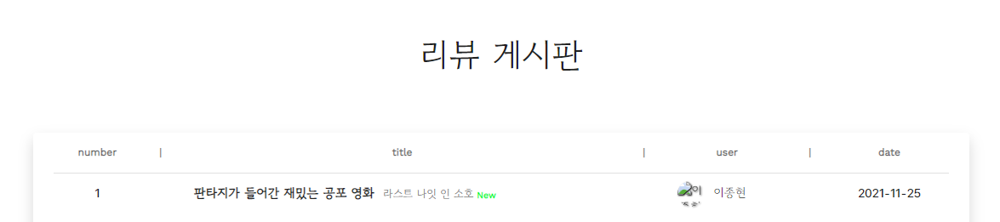

* 로그인하지 않으면 리뷰 게시판을 볼 수 없다.

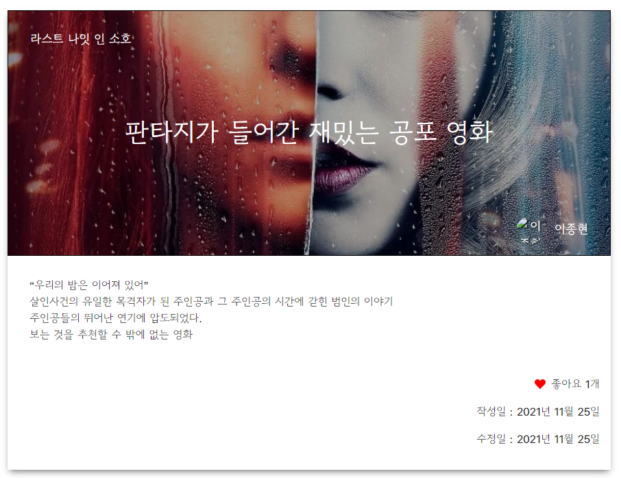

* 작성자 본인이 해당 리뷰에 들어가야만 수정과 삭제 버튼이 보인다.
* 로그인된 이용자만 댓글을 달 수 있고, 본인만 삭제가 가능하다.
* 제목, 내용, 좋아요 갯수,  작성일 및 수정일을 볼 수 있다.
* 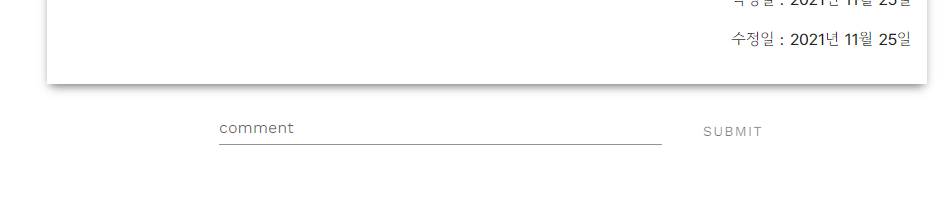
* 댓글 수정 삭제가 가능하다.


### 5. 기타

i. 최소한 5개 이상의 URL 및 페이지를 구성해야 합니다. 

ii. HTTP Method와 상태 코드는 상황에 맞게 적절하게 반환되어야 하며, 필요에 따라 메시지 프레임워크 등을 사용하여 에러 페이지를 구성해야 합니다. 

iii. 필요한 경우 Ajax를 활용한 비동기 요청을 통해 사용자 경험을 향상 시켜야 합니다.


## 전체 서비스 미리보기

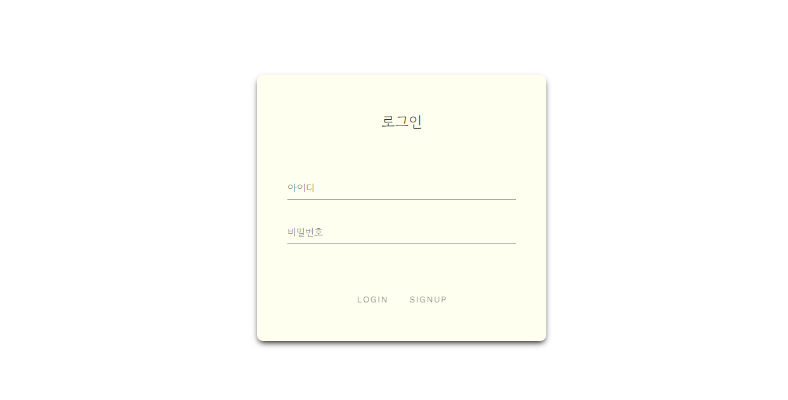

* 모든 서비스는 로그인한 유저만 접근 가능하다.

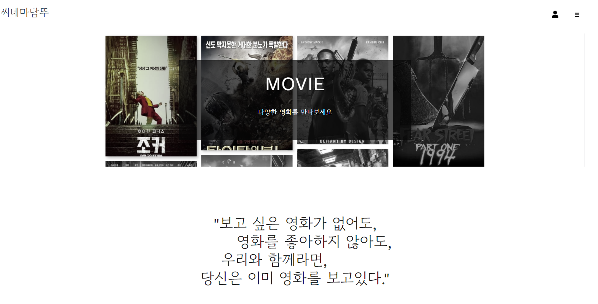

* 홈 화면에서 전체 사이트를 미리 볼수 있다.

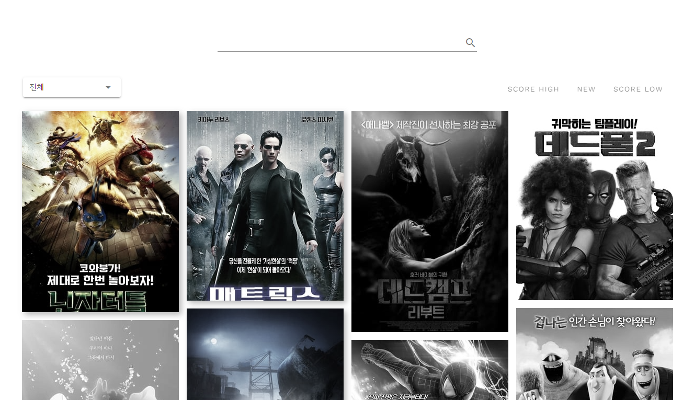

* 전체 영화 리스트 및 필터 적용을 할 수 있고, 검색이 가능하다.

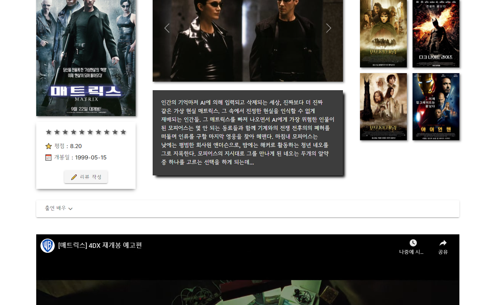

* 영화의 주요 정보와 관련 영화, 평점 등록이 가능하고 유튜브 예고편을 볼 수 있다.
* 댓글 및 리뷰를 작성할 수 있다.

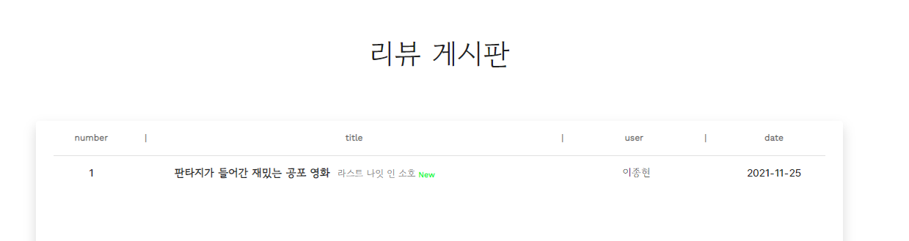

* 리뷰 목록을 볼 수 있고 다른 유저의 글을 좋아요 및 댓글 작성이 가능하다.
* 하루가 지나지 않은 글은 new로 표시된다.

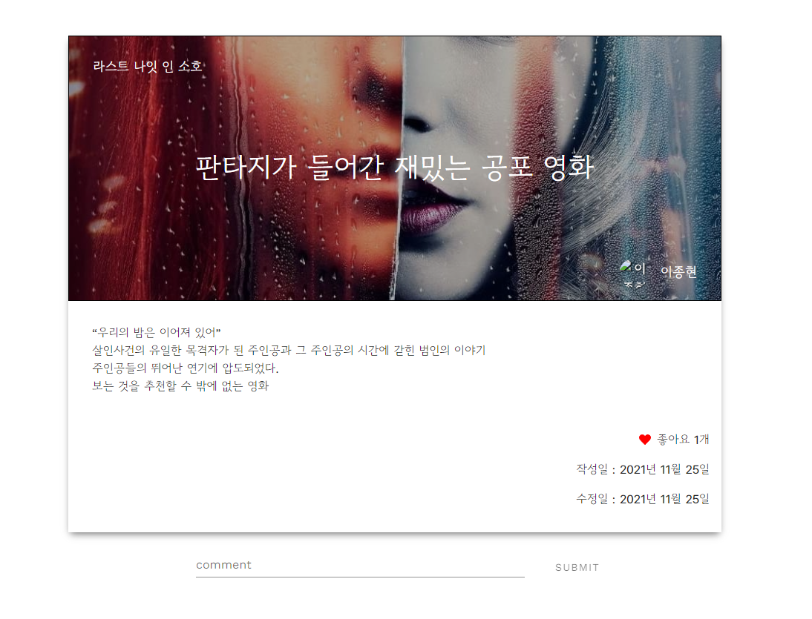

* 리뷰 디테일 페이지에서 영화, 유저 페이지로 이동할 수 있고, 좋아요 댓글이 가능하다.
* 작성자 본인만 수정 및 삭제가 가능하다.

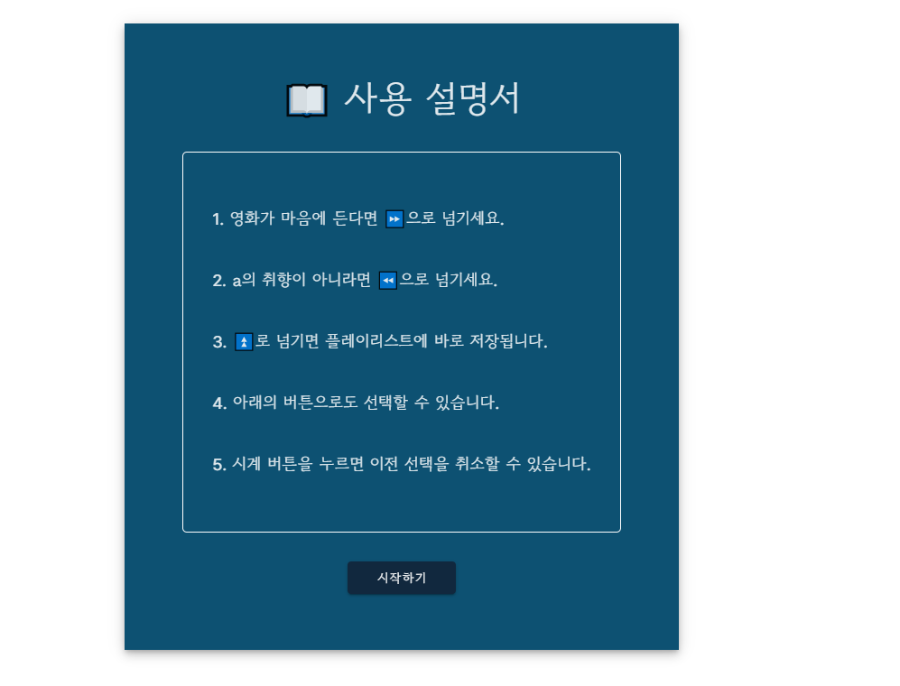

* 영화 추천을 위한 틴더 사용법을 스낵바로 표시한다.

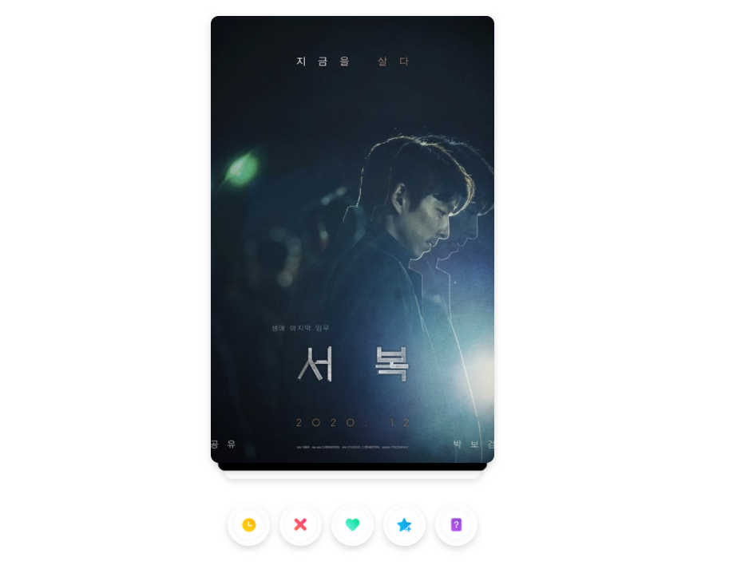

* 15개의 영화를 선택하여 유저의 취향을 분석한다.

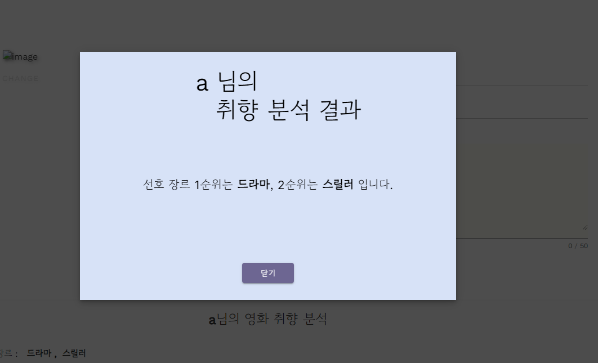

* 선호 장르 1, 2위를 보여준다.

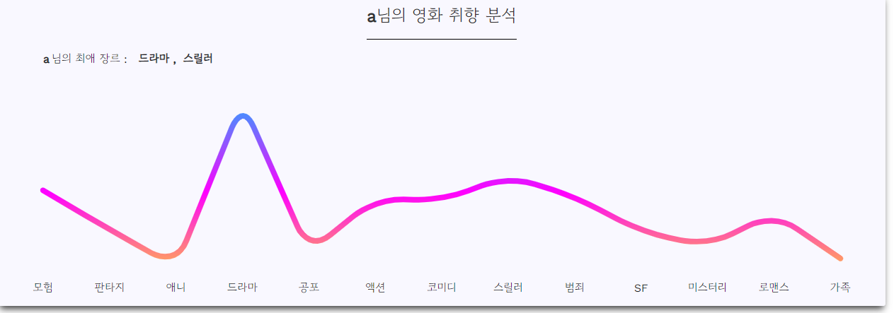

* 구체적인 취향 분석 자료를 그래프로 표시한다.

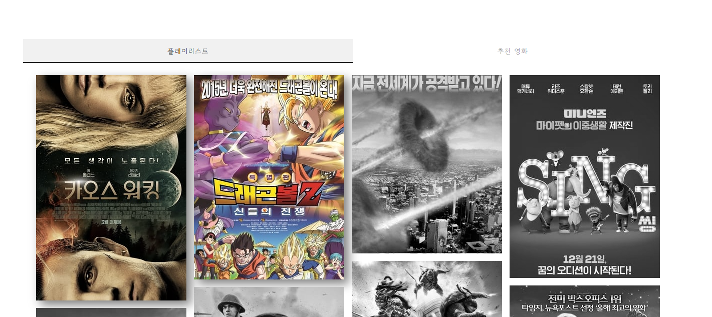

* 유저가 북마크한 플레이리스트와 추천영화를 보여준다.


## 배포 서버 URL


https://cinemadamtou.netlify.app/


## 프로젝트 후기

### 이재희


### 이종현

스터디를 통해 2번의 프로젝트 경험이 있었지만 처음하는 것처럼 힘들고 어려웠다.

초기엔 기본 기능 구현만으로도 막막했지만 팀원과 함께라서 열흘 가까운 시간동안 힘을 낼 수 있었다.

강의를 들으면서 배운 내용이었지만 직접 처음부터 프로젝트를 구현하면서 많이 성장한 것이 느껴진다.

좋은 결과물을 목표로 잠을 줄이면서 열심히 했고, 결과물이 예상보다 더 잘 나온 것 같아서 기쁘다.

협업이 얼마나 중요한지, 또 소통이 협업에 얼마나 중요한지를 배운 시간이었다.

온라인 상에서의 협업이었지만 팀원과 많은 생각을 공유하기위해 노력했고, 많이 가까워진 것 같다.

배우는 것도 중요하지만 직접 해보고 시행착오를 겪으면서 그것을 해결할 때 이 지식이 진짜 내것이 되는 것을 느꼈다.

나에겐 이 프로젝트가 꽤 긴 시간 생각 날 것 같다.

프로젝트가 끝나고 망가진 몸을 회복하고 싶다.


